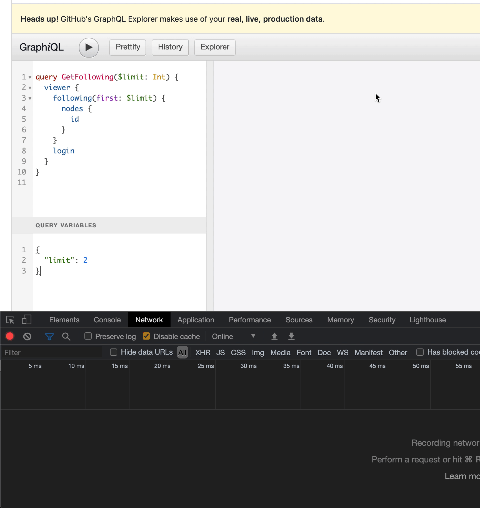
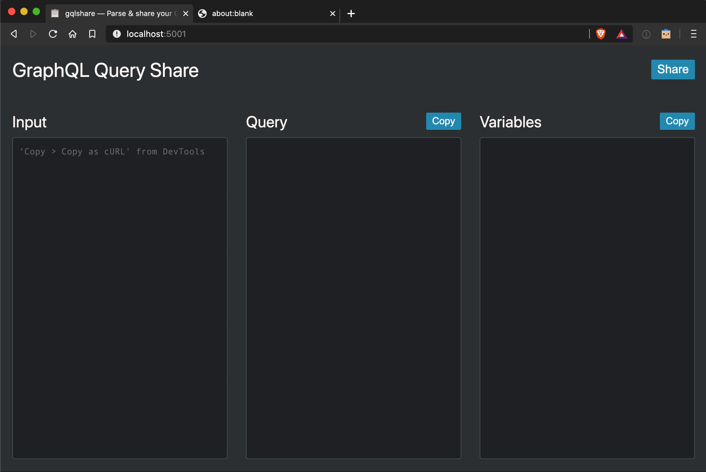

# GraphQL Query Share

Parse a GraphQL query from cURL, and share with others.

## Why?

If your GraphQL query or mutation isn’t working as expected, it’s likely you’ll need to share the request with a team member. [gqlshare](https://gqlshare.dev) makes this slightly easier by:

- removing the noise from the request payload & focusing on the query & variables
- providing a unique URL which will reveal the variables & response when loaded

## How?

Copy the request in cURL format from DevTools:

Paste into gqlshare:

## Privacy

When pasting into gqlshare, your request may include sensitive information such as cookies or tokens. This is completely ignored, and will not be shared or reproduced when sharing a query.

All processing happens on the client side. We don't store any request data at all.
